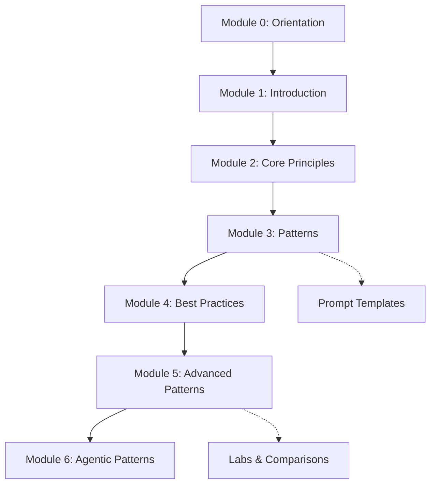

# Prompt Engineering Playbook

> A seven-module curriculum + stack-specific prompt templates for AI-assisted development — works with any LLM.

[](https://doi.org/10.5281/zenodo.18827631)
[](LICENSE)
[](https://kunalsuri.github.io/prompt-engineering-playbook/)
[](https://github.com/kunalsuri/prompt-engineering-playbook/actions/workflows/quality-nonmarkdown.yml)

**[🌐 View the Documentation Site →](https://kunalsuri.github.io/prompt-engineering-playbook/)**

> **Tested environment:** Verified in VS Code 1.96+ with GitHub Copilot Pro/Enterprise. Prompt files are plain Markdown and work with any coding agent.

---

## Who This Is For

- **For:** developers, contributors, educators, and researchers who want practical prompt-engineering curriculum and reusable prompt templates.
- **For:** teams using VS Code + GitHub Copilot who need structured `.prompt.md` workflows.
- **Not for:** model training, benchmark leaderboards, or framework-specific SDK implementations.

## Quick Navigation

- [Quick Start (60 seconds)](#quick-start-60-seconds)
- [Pick Your Path](#pick-your-path)
- [What's in This Repo](#whats-in-this-repo)
- [Available Stacks](#available-stacks)
- [How Prompt Files Work (VS Code Copilot)](#how-prompt-files-work-vs-code-copilot)
- [Contributing](#contributing)

## For AI Agents

If you are an AI assistant or automation reading this repository:

- Start with [llms.txt](https://github.com/kunalsuri/prompt-engineering-playbook/blob/main/llms.txt) for the repository purpose and structure contract.
- Use [GETTING-STARTED.md](GETTING-STARTED.md) for installation and usage flow.
- Follow [CONTRIBUTING.md](CONTRIBUTING.md) for formatting, citation, and prompt-file requirements.

## Quick Start (60 seconds)

> **Safety note:** Run repository scripts inside a Python virtual environment to avoid polluting system packages.
> ```bash
> python3 -m venv .venv && source .venv/bin/activate
> pip install -r requirements-docs.txt -r requirements-dev.txt
> ```

For a local/manual setup path (no `curl` pipe) plus verification steps, see [GETTING-STARTED.md](GETTING-STARTED.md#manual-install-no-curl-bash).

**Option A — Use as a GitHub template:**
Click **"Use this template"** at the top of this page to create your own copy with all files included.

**Option B — Grab files for one stack:**

```bash
# Example: set up Python prompts in your project
mkdir -p .github/prompts

# Base instructions (Copilot reads this automatically)
curl -o .github/copilot-instructions.md \
  https://raw.githubusercontent.com/kunalsuri/prompt-engineering-playbook/main/prompts/python/copilot-instructions.md

# All Python prompt files
curl -o .github/prompts/create-feature.prompt.md \
  https://raw.githubusercontent.com/kunalsuri/prompt-engineering-playbook/main/prompts/python/prompts/create-feature.prompt.md

# Repeat for each prompt file you need, or clone and copy:
git clone https://github.com/kunalsuri/prompt-engineering-playbook.git
cp -r prompt-engineering-playbook/prompts/python/prompts/*.prompt.md .github/prompts/
```

---

## Pick Your Path

### 🎓 [I want to **learn** prompt engineering →](learn/README.md)

A seven-module curriculum that takes you from first principles through advanced techniques like RAG, adversarial robustness, systematic evaluation, and agentic architectures. Each module includes worked examples and hands-on exercises. No prior prompt engineering experience required.

### ⚡ [I want to **use** prompt templates →](prompts/README.md)

Copy-paste-ready prompt files for Python, React/TypeScript, React + FastAPI, and Node.js/TypeScript projects. Optimized for VS Code Copilot's agent mode, but the prompt content works with any LLM. Pick your stack, grab the files, and start building.

### 📚 [I want **20 copy-paste recipes** for everyday tasks →](learn/cookbook.md)

Ready-to-use prompts for writing, research, analysis, communication, and decision-making — no programming required. Each recipe is tagged with the prompting patterns it uses.

### 🔧 [I want to **set up** my project →](GETTING-STARTED.md)

Step-by-step guide to installing these templates in your own project (with first-class VS Code Copilot integration) and customizing templates for your team.

---


## Learning Path



## What's in This Repo

```
prompt-engineering-playbook/
│
├── learn/                     🎓 Seven-module curriculum
│   ├── 00-orientation.md      ← Story-first on-ramp (no jargon, no code)
│   ├── 01–06-*.md             ← Core modules (Introduction → Agentic Patterns)
│   ├── comparisons/           ← Research-backed technique comparisons (CoT, ReAct, Few-Shot…)
│   ├── prompt-examples/       ← Worked examples for each pattern
│   ├── labs/                  ← Six runnable Python experiments + failure gallery
│   ├── decisions/             ← Architecture Decision Records (why we chose X over Y)
│   ├── solutions/             ← Reference solutions for all module exercises
│   └── *.md                   ← Guides: cheatsheet, cookbook, glossary, debugging, meta-prompting…
│
├── prompts/                   ⚡ Reusable prompt templates by stack
│   ├── python/                ← 7 prompts + copilot-instructions.md
│   ├── react-typescript/      ← 8 prompts + copilot-instructions.md
│   ├── react-fastapi/         ← 3 prompts + copilot-instructions.md
│   ├── nodejs-typescript/     ← 4 prompts + copilot-instructions.md
│   ├── shared/                ← Evaluation template, README base, JSON schema
│   └── user-prompts/          ← Generic everyday prompts (non-coding)
│
├── scripts/                   🔧 Repo automation & per-stack setup helpers
│   ├── setup.sh               ← Project setup script
│   ├── check-citations.py     ← Validates all [CitationKey] references
│   ├── check-lab-sync.py      ← Ensures lab .py and .ipynb files stay in sync
│   ├── lint-*.sh              ← Linters for prompt frontmatter and copilot instructions
│   ├── validate-prompt-schema.py ← JSON Schema validation for .prompt.md files
│   ├── run-notebook-smoke.py  ← Smoke-tests all Jupyter notebooks
│   └── {python,react-typescript,react-fastapi,nodejs-typescript}/setup.sh
│
├── .github/                   🤖 CI workflows, issue templates, Copilot instructions
├── assets/                    🎨 CSS and favicon for the documentation site
├── docs_src/                  📎 Symlinks used by MkDocs to build the docs site
│
├── README.md                  ← You are here
├── GETTING-STARTED.md         ← Installation and first-use walkthrough
├── CONTRIBUTING.md            ← Contributor guidelines and commit conventions
├── CHANGELOG.md               ← Version history
├── ROADMAP.md                 ← Planned features and future work
├── ARCHITECTURE.md            ← Deep-dive architecture documentation
├── DEVELOPMENT_WORKFLOW.md    ← Step-by-step developer workflows
├── CONTRIBUTING_AI.md         ← AI-agent-specific contribution guide
├── AGENT.md                   ← General AI agent context file
├── CLAUDE.md                  ← Claude Code context file
├── REPOSITORY_MAP.md          ← Full navigable file inventory
├── TECHNICAL-REPORT.md        ← Technical report on the playbook
├── BETA-RELEASE-NOTES.md      ← Beta-specific release notes
├── SECURITY.md                ← Security policy
├── CODE_OF_CONDUCT.md         ← Community code of conduct
├── references.md              ← Bibliography (APA, with DOIs)
├── llms.txt                   ← Machine-readable repo summary for LLMs
├── mkdocs.yml                 ← Documentation site configuration
├── requirements-docs.txt      ← Docs build dependencies
├── requirements-dev.txt       ← Dev/CI dependencies
└── Makefile                   ← Common dev tasks (make sync, make build, make check…)
```

---

## Available Stacks

| Stack | Instructions | Prompts | Setup Script |
|-------|-------------|---------|-------------|
| **Python** | [copilot-instructions.md](prompts/python/copilot-instructions.md) | [7 prompts](prompts/python/prompts/README.md) | `setup.sh --stack python` (see [GETTING-STARTED.md](GETTING-STARTED.md#step-3-copy-templates-into-your-project)) |
| **React + TypeScript** | [copilot-instructions.md](prompts/react-typescript/copilot-instructions.md) | [8 prompts](prompts/react-typescript/prompts/README.md) | `setup.sh --stack react-typescript` (see [GETTING-STARTED.md](GETTING-STARTED.md#step-3-copy-templates-into-your-project)) |
| **React + FastAPI** | [copilot-instructions.md](prompts/react-fastapi/copilot-instructions.md) | [3 prompts](prompts/react-fastapi/prompts/README.md) | `setup.sh --stack react-fastapi` (see [GETTING-STARTED.md](GETTING-STARTED.md#step-3-copy-templates-into-your-project)) |
| **Node.js + TypeScript** | [copilot-instructions.md](prompts/nodejs-typescript/copilot-instructions.md) | [4 prompts](prompts/nodejs-typescript/prompts/README.md) | `setup.sh --stack nodejs-typescript` (see [GETTING-STARTED.md](GETTING-STARTED.md#step-3-copy-templates-into-your-project)) |

Each stack includes a `copilot-instructions.md` (base rules Copilot follows automatically) and task-specific `.prompt.md` files (invoked on demand via Copilot Chat). The prompt content itself is model-agnostic — you can paste it into ChatGPT, Claude, Gemini, or any other LLM.

---

## How Prompt Files Work (VS Code Copilot)

When you place files in your project's `.github/` directory, VS Code Copilot picks them up automatically:

```
your-project/
├── .github/
│   ├── copilot-instructions.md    ← Always active (style, conventions, tooling)
│   └── prompts/
│       ├── create-feature.prompt.md   ← Invoke with /create-feature in Copilot Chat
│       ├── review-code.prompt.md      ← Invoke with /review-code
│       └── ...
```

The YAML frontmatter `mode: 'agent'` enables Copilot to read files, run commands, and iterate autonomously. See [GETTING-STARTED.md](GETTING-STARTED.md) for the full walkthrough.

---

## Contributing

Contributions are welcome — whether it's fixing a typo, adding an exercise, or creating prompts for a new stack. See [CONTRIBUTING.md](CONTRIBUTING.md) for guidelines, commit conventions, and review checklists.

## License

This project is licensed under the MIT License. See [LICENSE](LICENSE) for details.

## ✍️ How to Cite & AI Usage

### Citation details

If you use this framework to structure your research, paper framing, or methodology curriculum, please cite it using the following format and check [references.md](references.md) for the bibliography. Machine-readable citation and archival metadata are also provided in [CITATION.cff](https://github.com/kunalsuri/prompt-engineering-playbook/blob/main/CITATION.cff) and [.zenodo.json](https://github.com/kunalsuri/prompt-engineering-playbook/blob/main/.zenodo.json).

**APA Format:**
> Suri, K. (2026). *Prompt Engineering Playbook: Curriculum and Reusable Prompt Templates for LLM-powered Development (v0.1.0-beta)*. Zenodo. https://doi.org/10.5281/zenodo.18827631

**BibTeX:**
```bibtex
@software{suri2026promptengineering,
  author       = {Suri, Kunal},
  title        = {Prompt Engineering Playbook: Curriculum and Reusable Prompt Templates for LLM-powered Development},
  year         = {2026},
  version      = {v0.1.0-beta},
  publisher    = {Zenodo},
  doi          = {10.5281/zenodo.18827631},
  url          = {https://doi.org/10.5281/zenodo.18827631},
}

```
---

<details>
<summary><strong>AI Transparency and Responsible Use</strong></summary>

* **Responsible Use of AI:** 
  - **Data Privacy:** Prioritize local open-weight models for processing sensitive or educational data to ensure data sovereignty.
  - **Human Validation:** All AI-generated outputs are validated before integration into teaching, research, or decision-making workflows.
  - **Compliance:** This project aligns with <a href="https://research-and-innovation.ec.europa.eu/news/all-research-and-innovation-news/guidelines-responsible-use-generative-ai-research-developed-european-research-area-forum-2024-03-20_en" target="_blank" rel="noopener noreferrer">EU Guidance on Responsible Use of Generative AI in Research</a>.

* **Coding:** This project was developed with assistance from the following AI tools: GitHub Copilot (Pro/Enterprise), Google's Antigravity IDE, Local Open-Weight Models (via Ollama in VS Code, e.g., Mistral). These tools were used primarily for code generation, completion, and debugging. All AI-assisted code was independently reviewed, tested, and refined by the authors. The authors take full responsibility for the correctness, security, and integrity of the codebase.

* **Writing & Ideation:**  Large language model (LLM) tools — specifically Anthropic Claude and Google Gemini models — were used to support brainstorming, structural organization, and language refinement during the writing process. All underlying arguments, intellectual contributions, and conclusions originate with the authors. All AI-assisted material was critically reviewed and substantially revised by the authors, who take full responsibility for the accuracy, originality, and integrity of the published content.

</details>

---
