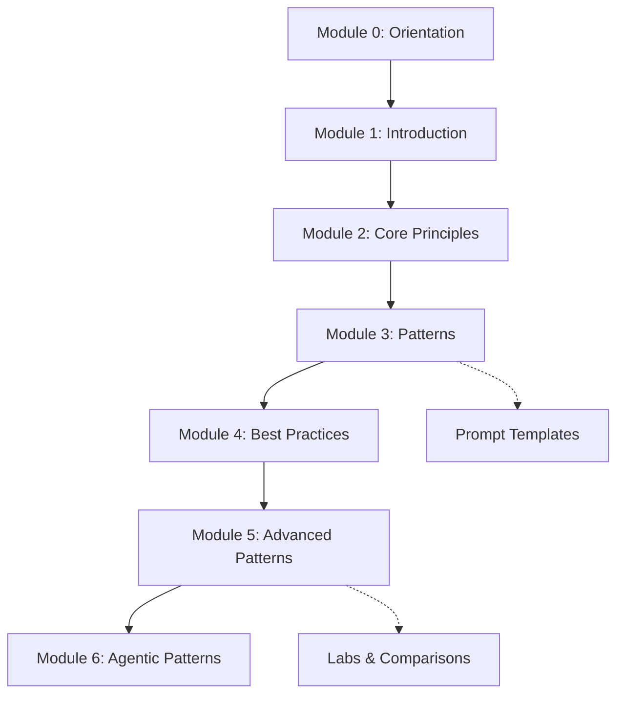

# Prompt Engineering Playbook: Curriculum and Reusable Prompt Templates for LLM-powered Development

> Learn prompt engineering end-to-end and apply it with prompt templates for AI-assisted development.

Seven-module curriculum + stack-specific `.prompt.md` templates that can be used with any coding agent.


[](LICENSE)
[](https://kunalsuri.github.io/prompt-engineering-playbook/)
[](https://github.com/kunalsuri/prompt-engineering-playbook/actions/workflows/quality-nonmarkdown.yml)

<p align="center">
  <a href="https://kunalsuri.github.io/prompt-engineering-playbook/">
    <b>🌐 View the Documentation Site →</b>
  </a>
</p>

---

> **Tested environment:** Verified in VS Code 1.96+ with GitHub Copilot Pro/Enterprise. The prompt files are plain Markdown and can be adapted for other coding agents.

> **Safety requirement (sandbox first):** Run repository scripts only inside a local Python virtual environment (`.venv`) to avoid polluting system packages and to reduce risk of accidental environment breakage.

```bash
python3 -m venv .venv
source .venv/bin/activate
python -m pip install -r requirements-docs.txt -r requirements-dev.txt
```

For script execution, prefer explicit `.venv` binaries:

```bash
.venv/bin/python scripts/validate-prompt-schema.py
make check
```

## Who This Is For

- **For:** developers, contributors, educators, and researchers who want practical prompt-engineering curriculum and reusable prompt templates.
- **For:** teams using VS Code + GitHub Copilot who need structured `.prompt.md` workflows.
- **Not for:** model training, benchmark leaderboards, or framework-specific SDK implementations.

## Quick Navigation

- [Quick Start (60 seconds)](#quick-start-60-seconds)
- [Beta Release Notes](BETA-RELEASE-NOTES.md)
- [Pick Your Path](#pick-your-path)
- [Available Stacks](#available-stacks)
- [How Prompt Files Work (VS Code Copilot)](#how-prompt-files-work-vs-code-copilot)
- [Contributing](#contributing)

## For AI Agents

If you are an AI assistant or automation reading this repository:

- Start with [llms.txt](https://github.com/kunalsuri/prompt-engineering-playbook/blob/main/llms.txt) for the repository purpose and structure contract.
- Use [GETTING-STARTED.md](GETTING-STARTED.md) for installation and usage flow.
- Follow [CONTRIBUTING.md](CONTRIBUTING.md) for formatting, citation, and prompt-file requirements.

## Quick Start (60 seconds)

For a local/manual setup path (no `curl` pipe) plus verification steps, see [GETTING-STARTED.md](GETTING-STARTED.md#manual-install-no-curl-bash).

**Option A — Use as a GitHub template:**
Click **"Use this template"** at the top of this page to create your own copy with all files included.

**Option B — Grab files for one stack:**

```bash
# Example: set up Python prompts in your project
mkdir -p .github/prompts

# Base instructions (Copilot reads this automatically)
curl -o .github/copilot-instructions.md \
  https://raw.githubusercontent.com/kunalsuri/prompt-engineering-playbook/main/prompts/python/copilot-instructions.md

# All Python prompt files
curl -o .github/prompts/create-feature.prompt.md \
  https://raw.githubusercontent.com/kunalsuri/prompt-engineering-playbook/main/prompts/python/prompts/create-feature.prompt.md

# Repeat for each prompt file you need, or clone and copy:
git clone https://github.com/kunalsuri/prompt-engineering-playbook.git
cp -r prompt-engineering-playbook/prompts/python/prompts/*.prompt.md .github/prompts/
```

---

## Pick Your Path

### 🎓 [I want to **learn** prompt engineering →](learn/README.md)

A seven-module curriculum that takes you from first principles through advanced techniques like RAG, adversarial robustness, systematic evaluation, and agentic architectures. Each module includes worked examples and hands-on exercises. No prior prompt engineering experience required.

### ⚡ [I want to **use** prompt templates →](prompts/README.md)

Copy-paste-ready prompt files for Python, React/TypeScript, React + FastAPI, and Node.js/TypeScript projects. Optimized for VS Code Copilot's agent mode, but the prompt content works with any LLM. Pick your stack, grab the files, and start building.

### 📚 [I want **20 copy-paste recipes** for everyday tasks →](learn/cookbook.md)

Ready-to-use prompts for writing, research, analysis, communication, and decision-making — no programming required. Each recipe is tagged with the prompting patterns it uses.

### 🔧 [I want to **set up** my project →](GETTING-STARTED.md)

Step-by-step guide to installing these templates in your own project (with first-class VS Code Copilot integration) and customizing templates for your team.

---


## Learning Path



## What's Inside

```
├── learn/                     🎓 Seven-module curriculum + deep-dive comparisons
│   ├── 00-orientation.md               Story-first on-ramp (no technical background needed)
│   ├── 01-introduction.md
│   ├── 02-core-principles.md
│   ├── 03-patterns.md
│   ├── 04-best-practices.md
│   ├── 05-advanced-patterns.md
│   ├── 06-agentic-patterns.md          Plan-and-execute, reflection loops, multi-agent systems
│   ├── comparisons/                    Chain-of-Thought, ReAct, Few-Shot, cross-model portability
│   └── prompt-examples/                Worked examples for each pattern
│
├── prompts/                   ⚡ Reusable prompt templates
│   ├── shared/                Instructions that apply to ALL stacks
│   ├── python/                Python-specific prompts & instructions
│   ├── react-typescript/      React + TypeScript prompts & instructions
│   ├── react-fastapi/         Full-stack React + FastAPI prompts
│   └── nodejs-typescript/     Node.js + TypeScript prompts & instructions
│
├── scripts/                   🔧 Setup helper scripts
│   ├── python/setup.sh
│   ├── react-typescript/setup.sh
│   ├── react-fastapi/setup.sh
│   └── nodejs-typescript/setup.sh
│
├── GETTING-STARTED.md         How to install and use these templates
├── CONTRIBUTING.md            Guidelines for contributors
├── CHANGELOG.md               Version history and migration guide
└── references.md              Bibliography (APA, with DOIs)
```

---

## Available Stacks

| Stack | Instructions | Prompts | Setup Script |
|-------|-------------|---------|-------------|
| **Python** | [copilot-instructions.md](prompts/python/copilot-instructions.md) | [7 prompts](prompts/python/prompts/README.md) | `setup.sh --stack python` (see [GETTING-STARTED.md](GETTING-STARTED.md#step-3-copy-templates-into-your-project)) |
| **React + TypeScript** | [copilot-instructions.md](prompts/react-typescript/copilot-instructions.md) | [8 prompts](prompts/react-typescript/prompts/README.md) | `setup.sh --stack react-typescript` (see [GETTING-STARTED.md](GETTING-STARTED.md#step-3-copy-templates-into-your-project)) |
| **React + FastAPI** | [copilot-instructions.md](prompts/react-fastapi/copilot-instructions.md) | [3 prompts](prompts/react-fastapi/prompts/README.md) | `setup.sh --stack react-fastapi` (see [GETTING-STARTED.md](GETTING-STARTED.md#step-3-copy-templates-into-your-project)) |
| **Node.js + TypeScript** | [copilot-instructions.md](prompts/nodejs-typescript/copilot-instructions.md) | [4 prompts](prompts/nodejs-typescript/prompts/README.md) | `setup.sh --stack nodejs-typescript` (see [GETTING-STARTED.md](GETTING-STARTED.md#step-3-copy-templates-into-your-project)) |

Each stack includes a `copilot-instructions.md` (base rules Copilot follows automatically) and task-specific `.prompt.md` files (invoked on demand via Copilot Chat). The prompt content itself is model-agnostic — you can paste it into ChatGPT, Claude, Gemini, or any other LLM.

---

## How Prompt Files Work (VS Code Copilot)

When you place files in your project's `.github/` directory, VS Code Copilot picks them up automatically:

```
your-project/
├── .github/
│   ├── copilot-instructions.md    ← Always active (style, conventions, tooling)
│   └── prompts/
│       ├── create-feature.prompt.md   ← Invoke with /create-feature in Copilot Chat
│       ├── review-code.prompt.md      ← Invoke with /review-code
│       └── ...
```

The YAML frontmatter `mode: 'agent'` enables Copilot to read files, run commands, and iterate autonomously. See [GETTING-STARTED.md](GETTING-STARTED.md) for the full walkthrough.

---

## Contributing

Contributions are welcome — whether it's fixing a typo, adding an exercise, or creating prompts for a new stack. See [CONTRIBUTING.md](CONTRIBUTING.md) for guidelines, commit conventions, and review checklists.

## License

This project is licensed under the MIT License. See [LICENSE](LICENSE) for details.

## ✍️ How to Cite & AI Usage

### Citation details

If you use this framework to structure your research, paper framing, or methodology curriculum, please cite it using the following format and check [references.md](references.md) for the bibliography. Machine-readable citation and archival metadata are also provided in [CITATION.cff](https://github.com/kunalsuri/prompt-engineering-playbook/blob/main/CITATION.cff) and [.zenodo.json](https://github.com/kunalsuri/prompt-engineering-playbook/blob/main/.zenodo.json).

**APA Format:**
> Suri, K. (2026). *Prompt Engineering Playbook: Curriculum and Reusable Prompt Templates for LLM-powered Development*. GitHub. https://github.com/kunalsuri/prompt-engineering-playbook

**BibTeX:**
```bibtex
@misc{suri2026promptengineering,
  author       = {Suri, Kunal},
  title        = {Prompt Engineering Playbook: Curriculum and Reusable Prompt Templates for LLM-powered Development},
  year         = {2026},
  publisher    = {GitHub},
  howpublished = {\url{https://github.com/kunalsuri/prompt-engineering-playbook}},
}

```
---

<details>
<summary><strong>AI Usage Declaration</strong></summary>

* **Coding:** GitHub Copilot (Pro/Enterprise), Google Antigravity, and open-weight models run via Ollama were used in Visual Studio Code to support development, primarily for code generation, completion, and debugging. All AI-assisted code was independently reviewed, tested, and refined by the authors. The authors take full responsibility for the correctness and integrity of the codebase.

* **Writing & Ideation:**  Large language model (LLM) tools — specifically Anthropic Claude and Google Gemini models — were used to support brainstorming, structural organization, and language refinement during the writing process. All underlying arguments, intellectual contributions, and conclusions originate with the authors. All AI-assisted material was critically reviewed and substantially revised by the authors, who take full responsibility for the accuracy, originality, and integrity of the published content.

</details>

---