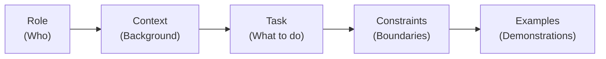

# Module 1 — Introduction to Prompt Engineering

## Learning Objectives

By the end of this module, you will be able to articulate what prompt engineering is, explain why it matters for modern AI-assisted workflows, distinguish between naive and well-engineered prompts, and identify the core components of an effective prompt.

---

## 1.1 What Is Prompt Engineering?

Prompt engineering is the disciplined practice of designing, structuring, and iterating on natural-language inputs to large language models (LLMs) in order to elicit accurate, useful, and reproducible outputs. Although the term may suggest a narrow, mechanical activity, it is better understood as a form of **human–AI communication design** — one that draws on principles from technical writing, cognitive science, and software engineering.

Consider the analogy of a search engine query. A novice user might type "fix my code," while an experienced user types `python TypeError NoneType subscriptable pandas DataFrame merge`. The difference in output quality is dramatic, and the underlying skill is the same: knowing how to specify intent precisely enough that a system can act on it. Prompt engineering applies this same principle to LLMs, but with far richer expressive possibilities — because LLMs accept and produce natural language, the design space for prompts is essentially unbounded.

This matters because LLMs are increasingly embedded in production toolchains. GitHub Copilot, ChatGPT, Claude, and domain-specific agents all depend on prompts as their primary interface. The quality of the prompt directly determines the quality of the output, and in professional contexts — code generation, security auditing, research synthesis — the gap between a mediocre prompt and a well-engineered one can be the difference between useful automation and wasted compute.

## 1.2 A Motivating Example

Suppose you want an LLM to generate a Python function that validates email addresses. Compare two approaches:

**Naive prompt:**
```
Write a function to validate emails.
```

**Engineered prompt:**
```
Write a Python 3.12+ function called `validate_email` that:
- Accepts a single `str` argument and returns `bool`
- Uses `re` (no third-party libraries)
- Validates against RFC 5322 simplified rules: local part allows alphanumeric,
  dots, hyphens, and underscores; domain requires at least one dot with
  alphanumeric labels of 1–63 characters each
- Includes a Google-style docstring with Args, Returns, and Raises sections
- Includes three positive and three negative inline doctests
- Raises `TypeError` if the input is not a string
```

The naive prompt will produce *something* — but the output will vary unpredictably across models, sessions, and temperature settings. The engineered prompt constrains the design space: it specifies the language version, function signature, validation rules, documentation style, test expectations, and error-handling behavior. This is the essence of prompt engineering — **reducing ambiguity to increase reliability**.

## 1.3 The Anatomy of a Prompt

Every effective prompt, regardless of complexity, can be decomposed into a small set of structural components. Not all components are required for every prompt, but being aware of them helps you make deliberate choices about what to include.



**Role** — Who should the model act as? Assigning a role (e.g., "You are a senior security engineer") activates domain-relevant knowledge and calibrates the register of the response. Research by Zheng et al. [Zheng2023] suggests role assignment measurably improves task performance on domain-specific benchmarks.

**Context** — What background information does the model need? This includes project constraints, existing code, domain rules, or prior conversation history. LLMs have no persistent memory across sessions; every relevant fact must be supplied in the prompt or retrievable through tool use.

**Task** — What specifically should the model do? The clearest prompts use imperative verbs and explicit output specifications: "Generate a migration script that…", "Review this function for…", "Compare approaches A and B along dimensions X, Y, and Z."

**Constraints** — What are the boundaries? Constraints include format requirements (JSON, Markdown, specific schemas), negative instructions ("Do not use external libraries"), length limits, and style guides.

**Examples** — What does a correct output look like? Providing one or more input–output pairs (few-shot examples) is one of the most reliable techniques for steering model behavior, as demonstrated in Brown et al. [Brown2020].

### Message Roles in Chat-Based APIs

Most modern LLMs expose a chat-completion API organized around three message roles:

| Role | Purpose | Typical Content |
|------|---------|-----------------|
| **system** | Sets persistent instructions and behavioral constraints for the entire conversation. | Role assignment, output format, safety rules, domain context. |
| **user** | Contains the human's request — the actual task input. | Questions, code to review, data to transform. |
| **assistant** | Contains (or prefills) the model's response. Can also be used for few-shot examples. | Previous answers, in-context demonstrations. |

In **VS Code Copilot prompt files** (the `.prompt.md` format used throughout this repository), the system/user boundary is implicit: the YAML frontmatter configures the mode, while the Markdown body functions as the system-level instruction. The user message is supplied at invocation time. Understanding the underlying three-role structure is still valuable, because it maps directly to the API calls Copilot makes on your behalf and helps you reason about where instructions are placed.

## 1.4 Why This Repository Exists

This repository serves two complementary purposes. First, the `learn/` track (which you are reading now) provides a structured curriculum for learning prompt engineering from first principles through advanced techniques. Second, the `prompts/` template directories provide production-ready prompt files designed for direct use with VS Code and GitHub Copilot. The curriculum explains the *why*; the templates demonstrate the *how*.

As you progress through the modules, you will encounter cross-references to specific template files that exemplify the concepts under discussion. These are not decorative — examining real production prompts alongside the theory is the most effective way to develop practical fluency.

## 1.5 Where to Go Next

This module introduced the foundational concepts. The subsequent modules build progressively:

- **Module 2** (`02-core-principles.md`) covers the core principles that govern effective prompts: specificity, decomposition, iteration, and evaluation.
- **Module 3** (`03-patterns.md`) catalogs the major prompting patterns (few-shot, chain-of-thought, role-playing, ReAct) with worked examples.
- **Module 4** (`04-best-practices.md`) addresses production concerns: token management, context-window optimization, version control for prompts, and team workflows.
- **Module 5** (`05-advanced-patterns.md`) treats advanced topics: retrieval-augmented generation (RAG), adversarial robustness, multimodal prompting, and systematic evaluation.
- **Module 6** (`06-agentic-patterns.md`) covers agentic architectures: plan-and-execute, reflection loops, multi-agent collaboration, memory management, and tool-use safety.

The `comparisons/` subdirectory contains deep-dive analyses of specific techniques (e.g., Chain-of-Thought variants, ReAct vs. standard prompting). These are referenced from Modules 3 and 5 and can also be read independently.

---

## Check Your Understanding

<details>
<summary><strong>Q1: What are the five components of a well-structured prompt?</strong></summary>

**Answer:** **Role**, **Context**, **Task**, **Constraints**, and **Examples**. A prompt need not include all five, but explicitly considering each raises quality — even when you decide to omit one.

</details>

<details>
<summary><strong>Q2: A prompt that opens with “You are a senior DevOps engineer” is using which component?</strong></summary>

**Answer:** **Role assignment**. Role priming reduces ambiguity about voice, expertise level, and assumed audience, which measurably affects output quality on technical tasks.

</details>

<details>
<summary><strong>Q3: What is the key difference between prompt engineering and fine-tuning?</strong></summary>

**Answer:** Prompt engineering shapes model behaviour at **inference time** through natural language, without changing model weights. Fine-tuning updates the model’s weights using a training dataset. PE is faster to iterate and works with any API-accessible model; fine-tuning produces a specialised model with lower per-query latency.

</details>

---

## Exercises

**Exercise 1.1 — Prompt Decomposition.** Take the following naive prompt and rewrite it using all five structural components (Role, Context, Task, Constraints, Examples): *"Summarize this research paper."* Your engineered prompt should be specific enough that two different LLMs would produce substantially similar outputs.

**Exercise 1.2 — Ambiguity Identification.** Consider the prompt: *"Write tests for the User model."* List at least five ambiguities in this prompt (e.g., which testing framework? what constitutes the User model?). Then rewrite the prompt to eliminate each ambiguity.

**Exercise 1.3 — Comparative Analysis.** Using any LLM you have access to, submit both the naive and engineered email-validation prompts from Section 1.2. Compare the outputs along three dimensions: correctness, completeness, and consistency across repeated runs. Document your findings in a brief (200–300 word) analysis.

---

> **Validated against:** GPT-4o (2025-11), Claude 3.5 Sonnet, Gemini 1.5 Pro — February 2026.  
> Behavioral claims may drift as models are updated. Performance figures marked *(approx.)* are illustrative.

---

## References

- [Brown2020] Brown, T. B., Mann, B., Ryder, N., Subbiah, M., Kaplan, J., Dhariwal, P., … & Amodei, D. (2020). Language models are few-shot learners. *Advances in Neural Information Processing Systems, 33*, 1877–1901.
- [Zheng2023] Zheng, L., Chiang, W.-L., Sheng, Y., Zhuang, S., Wu, Z., Zhuang, Y., … & Stoica, I. (2023). Judging LLM-as-a-judge with MT-Bench and Chatbot Arena. *Advances in Neural Information Processing Systems, 36*.
