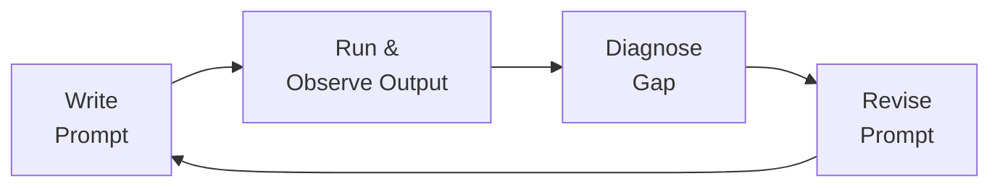

# Module 2 — Core Principles of Effective Prompting

## Learning Objectives

By the end of this module, you will be able to apply the four governing principles of prompt engineering — specificity, decomposition, iteration, and evaluation — and recognize how violations of these principles lead to unreliable LLM outputs.

!!! note "For Software Engineers"
    These four principles map directly to concepts you already know:

    | PE Principle | SE Analogue |
    |---|---|
    | **Specificity** | Typed function signatures / API contracts |
    | **Decomposition** | Single Responsibility Principle / modular design |
    | **Iteration** | TDD red–green–refactor loop |
    | **Evaluation** | Unit tests / acceptance criteria in CI |

    The key difference: in software you verify correctness with deterministic assertions; in PE you verify quality with probabilistic sampling over multiple runs.

---

## 2.1 Principle 1: Specificity

The single most impactful improvement you can make to any prompt is to increase its specificity. LLMs are stochastic systems: given an ambiguous input, they will resolve the ambiguity using distributional priors from their training data, which may or may not align with your intent. Specificity reduces the space of plausible interpretations, thereby increasing the probability that the model's output matches your expectations.

Specificity operates along multiple axes simultaneously. **Functional specificity** defines what the output should do: not "write a function" but "write a pure function that takes a `list[float]` and returns the geometric mean, raising `ValueError` on empty or negative inputs." **Structural specificity** defines how the output should be formatted: JSON with named keys, Markdown with H2 headers, a Python module with `__all__` exports. **Stylistic specificity** defines the register: formal academic prose, terse inline comments, user-facing error messages.

A useful heuristic is the **Substitution Test**: if you could replace a word in your prompt with a more precise term without changing your intent, you should. "Improve this code" → "Reduce the cyclomatic complexity of this function to ≤ 5 while preserving all existing test coverage." Every substitution narrows the output distribution.

### Example: Specificity in Practice

Consider a code-review prompt. The repository's `prompts/react-typescript/prompts/auditor-cybersecurity-features.prompt.md` exemplifies high specificity: it names exact compliance frameworks (OWASP Top 10, MITRE ATT&CK, NIST 800-53), specifies five analytical lenses (Red-Team, Blue-Team, AI Security, Zero-Day, Integrity), defines a severity taxonomy, and requires structured output with remediation timelines. This level of specificity is why the prompt reliably produces actionable security audits rather than generic advice.

## 2.2 Principle 2: Decomposition

Complex tasks should be broken into subtasks, each addressed by a focused prompt or prompt segment. This principle mirrors the software engineering practice of decomposing a monolithic function into composable units — and for the same reason: smaller, well-scoped units are easier to reason about, test, and debug.

Decomposition can occur at two levels. **Intra-prompt decomposition** structures a single prompt into sequential steps: "First, identify all API endpoints in the codebase. Second, classify each endpoint by authentication requirement. Third, flag endpoints that accept user input without validation." The model processes these as an ordered pipeline, and each step's output provides context for the next.

**Inter-prompt decomposition** distributes a workflow across multiple prompts, where the output of one becomes the input to another. This is the basis of multi-agent architectures and orchestration patterns such as ReAct [Yao2023], which are covered in detail in Module 3 and the comparison document `comparisons/react-comparison.md`.

The key insight is that decomposition is not merely a convenience — it is often a *requirement* for reliability. Research on chain-of-thought prompting [Wei2022] demonstrates that forcing explicit intermediate reasoning steps improves accuracy on tasks requiring multi-step logic, even when the model is capable of producing the correct answer in a single step. The mechanism is straightforward: intermediate steps provide checkpoints where errors can be caught and corrected, whether by the model itself or by a human reviewer.

### When Not to Decompose

Decomposition introduces overhead — additional tokens, latency, and coordination complexity. For atomic tasks with clear specifications (e.g., "convert this CSV row to a TypeScript interface"), a single well-specified prompt is preferable. The decision of when to decompose is itself a design judgment that improves with practice. A useful rule of thumb: if a task requires reasoning about more than two independent concerns simultaneously, decompose it.

## 2.3 Principle 3: Iteration

No prompt is correct on the first attempt. Prompt engineering is inherently an iterative process — you write a prompt, observe the output, diagnose the gap between expected and actual behavior, and revise. This cycle is analogous to the test-driven development (TDD) loop: red → green → refactor.

Effective iteration requires **systematic observation**. Rather than evaluating outputs impressionistically ("that looks about right"), define explicit success criteria before running the prompt. For code-generation prompts, these criteria might include: correct type annotations, passing a specific test suite, absence of deprecated API calls, adherence to a style guide. For text-generation prompts: factual accuracy against a reference, appropriate register, absence of hedging language, correct citation format.

When a prompt produces unsatisfactory output, the diagnostic question is: **what was ambiguous?** Common failure modes include under-specified constraints (the model made a reasonable choice, just not the one you wanted), missing context (the model lacked information it needed), conflicting instructions (two parts of the prompt imply different behaviors), and excessive scope (the model attempted everything at once and produced shallow results). Each diagnosis points to a specific revision strategy.

The repository's archived prompt versions (referenced in `CHANGELOG.md`) represent a real-world example of iteration at the repository level — the v0 prompts were comprehensive but unwieldy, and the current versions reflect a deliberate decision to reduce scope for better maintainability. This is iteration in action.

## 2.4 Principle 4: Evaluation

Evaluation closes the loop: it transforms prompt engineering from an art into an engineering discipline. Without systematic evaluation, you cannot distinguish between a prompt that works and a prompt that happened to work once.

Evaluation operates at three levels of rigor, appropriate to different contexts:

**Spot-checking** is the minimum viable evaluation: run the prompt 3–5 times with varied inputs and manually inspect the outputs. This catches gross failures — hallucinations, format violations, misunderstood instructions — and is appropriate for one-off prompts or early-stage iteration.

**Rubric-based evaluation** applies a structured scoring framework to each output. The `prompts/shared/evaluation-template.md` file in this repository provides such a rubric, covering dimensions like relevance, accuracy, completeness, format compliance, and safety. This is appropriate for prompts that will be reused across a team or project.

**Automated evaluation pipelines** programmatically assess outputs against ground-truth datasets, reference answers, or model-based judges. This is essential for prompts deployed in production systems. Module 5 (`05-advanced-patterns.md`) covers evaluation pipelines in depth, including the use of LLM-as-judge approaches and statistical methods for comparing prompt variants.

The key principle is that evaluation effort should be proportional to the prompt's blast radius. A prompt you use once in a personal project warrants spot-checking. A prompt that generates code merged into a production codebase warrants automated evaluation with regression tests.

---
## Check Your Understanding

<strong>Q1: Which of the four core principles is most directly relevant when a model returns generic, unhelpful output?</strong>

**Answer:** **Specificity (Principle 1)**. Generic output is typically a signal that the prompt lacks concrete constraints — missing audience, format, scope, or success criteria. Tightening those dimensions forces the model to narrow its output distribution.

<strong>Q2: Why does decomposition improve output quality on complex tasks?</strong>

**Answer:** Decomposition reduces the cognitive complexity of each individual model call, allowing it to focus on one sub-problem. It also makes debugging easier: when the output is wrong, you can identify which step failed rather than diagnosing an opaque end-to-end failure.

<strong>Q3: Describe the prompt iteration loop using exactly four labelled stages.</strong>

**Answer:** **Draft** → **Evaluate** (run the prompt; inspect outputs) → **Diagnose** (identify the specific failure mode) → **Revise** (change one variable). Iterate until outputs meet the acceptance criteria defined in the Evaluate stage.

---
## Exercises

**Exercise 2.1 — Specificity Audit.** Select any prompt file from the `prompts/python/prompts/` directory. For each instruction in the prompt, apply the Substitution Test: identify at least three places where a term could be made more specific. Rewrite those sections and compare the original and revised outputs.

**Exercise 2.2 — Decomposition Design.** You need an LLM to perform the following compound task: "Review a Pull Request for a FastAPI application, checking for security vulnerabilities, performance issues, and code-style violations, then produce a summary with prioritized action items." Design both an intra-prompt decomposition (single prompt with ordered steps) and an inter-prompt decomposition (multi-prompt pipeline). Discuss the trade-offs between the two approaches in 150–200 words.

**Exercise 2.3 — Iteration Log.** Choose a code-generation task relevant to your own work. Write an initial prompt, run it, document the output, diagnose the gaps, revise the prompt, and repeat for at least three iterations. Maintain a structured log with columns: Version | Prompt Text | Output Summary | Diagnosis | Revision Made. Reflect on what patterns you observe in your iteration process.

---

> **Validated against:** GPT-4o (2025-11), Claude 3.5 Sonnet, Gemini 1.5 Pro — February 2026.  
> Behavioral claims may drift as models are updated. Performance figures marked *(approx.)* are illustrative.

---

## References

- [Wei2022] Wei, J., Wang, X., Schuurmans, D., Bosma, M., Ichter, B., Xia, F., … & Zhou, D. (2022). Chain-of-thought prompting elicits reasoning in large language models. *Advances in Neural Information Processing Systems, 35*, 24824–24837.
- [Yao2023] Yao, S., Zhao, J., Yu, D., Du, N., Shafran, I., Narasimhan, K., & Cao, Y. (2023). ReAct: Synergizing reasoning and acting in language models. *International Conference on Learning Representations (ICLR)*.
