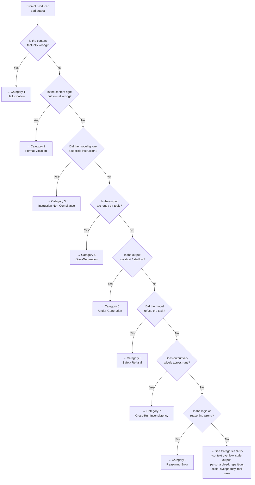

# Prompt Debugging Guide

A systematic decision tree for diagnosing and fixing prompt failures. This guide complements [Module 2 §2.3 (Iteration)](02-core-principles.md#23-principle-3-iteration) by providing a structured diagnostic framework — the prompt engineering equivalent of a debugger.

---

## When to Use This Guide

You have a prompt that:
- Produces incorrect, incomplete, or inconsistent output
- Works sometimes but fails unpredictably
- Worked before but stopped working (after a model update, input change, or prompt edit)
- Produces output in the wrong format, tone, or length

---

## Step 1: Classify the Failure

Every prompt failure falls into one of fifteen categories. Read the descriptions below and identify which one matches your observed problem. If multiple categories apply, address them in the order listed (earlier categories are more fundamental).

### Category 1: Hallucination

**Symptom:** The model generates content that is factually incorrect, fabricated, or unsupported by the provided context — while presenting it with the same confidence as accurate information.

**Common causes:**
- No grounding context provided (the model improvises from parametric knowledge)
- Context was provided but the prompt didn't instruct the model to stick to it
- The question exceeds the scope of the provided context but the prompt doesn't say "I don't know" is acceptable

**Diagnostic questions:**
1. Does the prompt include relevant reference material or context?
2. Does the prompt explicitly instruct the model to use only the provided context?
3. Does the prompt allow the model to say "insufficient information" when appropriate?

**Fix strategies:**
- Add a grounding instruction: "Answer using ONLY the information in the provided context."
- Add a fallback: "If the context does not contain the answer, state this explicitly."
- Wrap context in delimiters (`<context>...</context>`) so the model can clearly identify what to ground on.
- For code: include the actual source file contents rather than describing them from memory.

**Reference:** [Module 5, §5.1 (RAG)](05-advanced-patterns.md#51-retrieval-augmented-generation-rag)

---

### Category 2: Format Violation

**Symptom:** The output has the right *content* but the wrong *structure*. Examples: you asked for JSON but got Markdown, you asked for a table but got a bullet list, the JSON is wrapped in a code fence when you needed raw JSON.

**Common causes:**
- Format was described verbally but not demonstrated
- The model's default format for the task type overrode your instructions
- Conflicting format cues (e.g., "output as JSON" in the task, but the examples use Markdown)

**Diagnostic questions:**
1. Did you specify the exact format (not just "in JSON" but the specific schema with field names and types)?
2. Did you provide an example of the exact expected output?
3. Are format instructions at the end of the prompt (where they receive stronger attention)?

**Fix strategies:**
- Provide a concrete output example (the single most reliable format-fixing technique).
- Add the schema itself: `{"field_name": "type", ...}`.
- Place format instructions at both the beginning and end of the prompt (the Sandwich Principle from [Module 4, §4.2](04-best-practices.md#42-context-window-optimization)).
- Use structured output APIs when available (OpenAI `response_format`, Anthropic tool-use).

**Reference:** [Module 3, §3.6 (Constrained Output)](03-patterns.md#36-pattern-5-constrained-output)

---

### Category 3: Instruction Non-Compliance

**Symptom:** The model ignores or reinterprets specific instructions. For example: you said "do not include imports" but it added imports; you said "respond in 3 sentences" but it wrote 3 paragraphs; you assigned a role but the output doesn't reflect that expertise level.

**Common causes:**
- Conflicting instructions elsewhere in the prompt
- The ignored instruction is buried in the middle of a long prompt (lost-in-the-middle effect)
- The instruction is phrased ambiguously ("keep it short" vs. "respond in exactly 3 sentences")
- The model's training prior for the task type overrides the instruction

**Diagnostic questions:**
1. Is the instruction stated exactly once, or is it contradicted/modified elsewhere?
2. Where is the instruction positioned? (Beginning and end are strongest.)
3. Is the instruction quantified? ("3 sentences" not "short"; "≤5 findings" not "a few")
4. Could the instruction be interpreted differently than you intended?

**Fix strategies:**
- Move the critical instruction to the very end of the prompt (recency effect).
- Restate it: place it in the role section at the top AND as a constraint at the bottom.
- Quantify: replace qualitative terms with numbers.
- Resolve any contradictions by reading the entire prompt as if you were the model.

**Reference:** [Module 2, §2.1 (Specificity)](02-core-principles.md#21-principle-1-specificity)

---

### Category 4: Over-Generation

**Symptom:** The model produces far more output than requested. It adds unsolicited explanations, caveats, disclaimers, or extra content beyond the task scope.

**Common causes:**
- No explicit length or scope constraint
- The model defaults to "helpful and thorough" training behavior
- Task is broad enough that the model expands to fill the space

**Diagnostic questions:**
1. Does the prompt include an explicit length constraint?
2. Does the prompt define the exact scope of the deliverable?
3. Are there negative instructions ("Do NOT include explanations")?

**Fix strategies:**
- Add a hard length constraint: "Respond in exactly N items / sentences / lines."
- Add scope boundaries: "Address only X; do not discuss Y or Z."
- Add negative instructions: "Do not include disclaimers, caveats, or preambles."
- Use constrained output format (a JSON schema or table with fixed columns limits verbosity naturally).

---

### Category 5: Under-Generation

**Symptom:** The model's output is too brief, shallow, or incomplete. It misses aspects of the task, provides only a surface-level answer, or stops mid-response.

**Common causes:**
- Task is too broad and the model satisfices on a subset
- The prompt lacks explicit completeness criteria
- Context window is close to its limit, truncating the response
- The prompt says "be concise" and the model over-corrects

**Diagnostic questions:**
1. Did you enumerate all dimensions the output should cover?
2. Did you provide a completeness checklist or minimum-coverage threshold?
3. Is the prompt + expected response within 60% of the context window?
4. Did a "be concise" or similar instruction cause over-correction?

**Fix strategies:**
- Enumerate expected sections: "Cover (a) X, (b) Y, (c) Z. All three are required."
- Add a completeness checklist at the end: "Before finishing, verify you addressed: [list]."
- Remove or soften competing brevity instructions.
- If context window is the issue, decompose into multiple prompts.

**Reference:** [Module 2, §2.2 (Decomposition)](02-core-principles.md#22-principle-2-decomposition)

---

### Category 6: Safety Refusal

**Symptom:** The model refuses to perform the task, citing safety concerns, even though the task is legitimate (e.g., security audit, red-team testing, medical information for a professional context).

**Common causes:**
- The task involves topics that trigger safety filters (security, medical, legal, weapons)
- No contextual framing explains why the request is legitimate
- The prompt uses language that pattern-matches to harmful requests

**Diagnostic questions:**
1. Does the prompt explain the legitimate professional context?
2. Does the prompt use clinical/professional vocabulary rather than colloquial phrasing?
3. Is the model family known to be sensitive in this category?

**Fix strategies:**
- Add professional context: "This is for a security audit of our own application..."
- Reframe the task: instead of "how to exploit X," use "identify vulnerability patterns in X for defensive hardening."
- If the refusal persists across rephrasing, try a different model that may be calibrated differently for professional use cases.
- See [Module 5, §5.5.3](05-advanced-patterns.md#553-common-behavioral-differences) for model-specific refusal sensitivity differences.

---

### Category 7: Cross-Run Inconsistency

**Symptom:** The same prompt produces substantially different outputs each time it's run. One run is excellent, the next is mediocre, the third misinterprets the task entirely.

**Common causes:**
- Temperature is too high (>0.5 for deterministic tasks)
- The prompt is ambiguous enough that multiple valid interpretations exist
- Few-shot examples are too few or too diverse, leaving the model undertrained on your specific intent

**Diagnostic questions:**
1. What temperature is being used? (Lower = more deterministic.)
2. Run the prompt 5 times — do the outputs cluster into identifiable "modes" of interpretation?
3. Which interpretation is best? What distinguishes it from the others?

**Fix strategies:**
- Lower temperature (0.0–0.2 for deterministic tasks; 0.3–0.7 for creative ones).
- Add a concrete output example (anchors format and interpretation).
- Apply self-consistency: run N times, take majority answer ([Module 3, §3.4](03-patterns.md#34-pattern-3-chain-of-thought-cot), Wang et al. [Wang2023]).
- Increase specificity until only one interpretation is plausible.

---

### Category 8: Reasoning Error

**Symptom:** The model's output contains logical, mathematical, or causal reasoning mistakes. The format is correct and the model appears confident, but intermediate steps or final conclusions are wrong — e.g., incorrect arithmetic, flawed syllogisms, reversed cause-and-effect, or invalid comparisons.

**Common causes:**
- The task requires multi-step reasoning that the model attempts in a single forward pass
- No explicit instruction to show intermediate work
- The model guesses plausible-sounding conclusions rather than deriving them
- Numerical precision requirements exceed the model's reliable arithmetic range

**Diagnostic questions:**
1. Does the prompt ask the model to show its reasoning steps?
2. Can you trace the error to a specific intermediate step?
3. Is the error arithmetic (calculator-solvable) or logical (requires restructuring)?

**Fix strategies:**
- Add chain-of-thought: "Think step by step. Show all intermediate calculations."
- For arithmetic: instruct the model to use a tool/code interpreter rather than mental math.
- Break the reasoning into sub-prompts — solve each step independently.
- Add self-verification: "After reaching your conclusion, check it by working backwards."
- For complex logic: use few-shot CoT with a worked example that demonstrates the correct reasoning pattern.

**Reference:** [Module 3, §3.4 (Chain-of-Thought)](03-patterns.md#34-pattern-3-chain-of-thought-cot); [Chain-of-Thought Comparison](comparisons/chain-of-thought-comparison.md)

---

### Category 9: Context Window Overflow

**Symptom:** The model's output degrades suddenly — it ignores instructions from early in the prompt, produces truncated responses, or starts repeating itself. This often happens when the prompt is very long (3,000+ words) or includes large pasted documents.

**Common causes:**
- The combined prompt + expected response exceeds the model's context window
- Important instructions are buried in the middle of a long prompt (lost-in-the-middle effect)
- Large blocks of pasted content (code files, documents) dilute the instructions

**Diagnostic questions:**
1. Estimate total tokens (prompt + expected response). Does it exceed 60% of the model's window?
2. Where are your critical instructions positioned? Beginning? Middle? End?
3. Did this prompt work before with shorter inputs?

**Fix strategies:**
- Move critical instructions to the first and last paragraphs (Sandwich Principle).
- Summarize large pasted content instead of including it verbatim.
- Split into a multi-prompt pipeline: chunk the input, process each chunk, synthesize.
- If using agent mode, let the agent retrieve file contents on demand instead of pre-loading everything.
- Use a model with a larger context window for this specific task.

**Reference:** [Module 4, §4.1–§4.2 (Token Budget & Context Window)](04-best-practices.md#41-token-budget-management); [Liu2024]

---

### Category 10: Stale or Outdated Output

**Symptom:** The model generates code using deprecated APIs, references outdated library versions, recommends tools that no longer exist, or states facts that were true at training time but are no longer current.

**Common causes:**
- The model's training data has a knowledge cutoff
- The prompt does not specify the target version of a library, framework, or standard
- No grounding context provides current information

**Diagnostic questions:**
1. Does the output reference a specific version or API that has changed since the model's training cutoff?
2. Did the prompt specify the target version (e.g., "Python 3.12+", "React 19", "Node.js 22 LTS")?
3. Could RAG or tool use provide current information?

**Fix strategies:**
- Pin versions explicitly: "Use the `fetch` API (available in Node.js 18+). Do not use `node-fetch`."
- Provide current documentation as context: paste the relevant API reference into the prompt.
- Add a defensive instruction: "If you are unsure whether an API or library is current, flag it with [VERIFY]."
- Use RAG to inject up-to-date documentation at query time.
- Add a date anchor: "As of February 2026, the latest stable version of Next.js is 15.1."

**Reference:** [Module 5, §5.1 (RAG)](05-advanced-patterns.md#51-retrieval-augmented-generation-rag); Anti-pattern "The Stale Prompt" in [Module 4, §4.5](04-best-practices.md#45-common-anti-patterns)

---

### Category 11: Persona Bleed

**Symptom:** The model breaks character — it starts responding as a general assistant rather than the assigned role, mixes registers inappropriately (e.g., casual tone in a formal audit), or reveals system-level behavior (e.g., "As an AI language model, I...") despite explicit persona instructions.

**Common causes:**
- Role assignment is too brief or placed only at the beginning of a long prompt
- Conflicting tone instructions elsewhere in the prompt
- The model's safety training overrides the persona on certain topics
- User input contains persona-disrupting language

**Diagnostic questions:**
1. Is the role assignment specific enough? (Not just "You are an expert" but "You are a senior security engineer at a fintech company conducting a SOC 2 audit.")
2. Does any other part of the prompt contradict the persona's expected behavior?
3. Does the persona break on all inputs or only on certain sensitive topics?

**Fix strategies:**
- Reinforce the persona at both the beginning and end of the prompt.
- Add behavioral constraints: "Maintain this role throughout. Do not acknowledge that you are an AI."
- For sensitive topics: reframe with professional context ("This is for a legitimate security audit of our own system").
- Remove competing instructions that imply a different persona or tone.

**Reference:** [Module 3, §3.5 (Role-Playing)](03-patterns.md#35-pattern-4-role-playing-persona-assignment)

---

### Category 12: Repetition and Loops

**Symptom:** The model repeats the same phrase, sentence, or paragraph multiple times. In severe cases, it enters an infinite loop of repeating text until the response is truncated.

**Common causes:**
- Very high temperature (>1.0) combined with low top-p
- The prompt contains repetitive structures that the model mirrors
- Context window is near capacity, causing the model to "forget" it already said something
- Frequency/presence penalty is set to 0

**Diagnostic questions:**
1. What temperature and sampling parameters are being used?
2. Does the repetition start at a specific point in the response (often near the end of a long output)?
3. Is the prompt itself repetitive in structure?

**Fix strategies:**
- Lower temperature (0.2–0.5 for most tasks).
- Set `frequency_penalty` to 0.3–0.5 to discourage repeated token sequences.
- Add an explicit instruction: "Do not repeat any point already made."
- If the response is long, break it into sections with a multi-prompt pipeline.
- Set a `max_tokens` limit to prevent runaway generation.

---

### Category 13: Language and Locale Mismatch

**Symptom:** The model responds in the wrong language, uses locale-inappropriate date/number formats, applies cultural conventions that don't match the target audience, or mixes languages mid-response.

**Common causes:**
- No explicit language instruction in the prompt
- Input text is in a different language than the desired output
- The model defaults to English when instructions are ambiguous
- Date/number format expectations differ between locales (MM/DD vs. DD/MM)

**Diagnostic questions:**
1. Does the prompt explicitly specify the output language?
2. Is any part of the prompt (including pasted context) in a different language?
3. Are format conventions (dates, numbers, currency) explicitly specified?

**Fix strategies:**
- Add an explicit language instruction: "Respond entirely in Brazilian Portuguese (pt-BR)."
- Specify locale-sensitive formats: "Use DD/MM/YYYY for dates. Use comma as decimal separator."
- If the input language differs from desired output: "The input is in Japanese. Respond in English."
- For multilingual tasks: "Translate to French. Do not include the original English text."

---

### Category 14: Sycophancy and False Validation

**Symptom:** The model agrees with premises in the prompt that are incorrect, validates flawed reasoning, or tells the user what they appear to want to hear rather than providing an accurate answer. The model may say "Great question!" and then build on a false assumption.

**Common causes:**
- RLHF training biases the model toward agreeable responses
- The prompt frames incorrect information as established fact
- Leading questions direct the model toward a specific (wrong) answer
- No instruction to challenge assumptions

**Diagnostic questions:**
1. Does the prompt contain assertions that the model should verify rather than accept?
2. Is the question framed in a leading way ("Isn't it true that...")?
3. Did you test the same question with neutral framing?

**Fix strategies:**
- Add a critical-thinking instruction: "Before answering, identify any incorrect or unverified assumptions in the question."
- Reframe leading questions as neutral: "Is X true?" instead of "X is true, right?"
- Add a devil's advocate step: "List three reasons this approach might be wrong before defending it."
- Use the role of a reviewer or critic rather than an assistant.

---

### Category 15: Tool-Use Failure

**Symptom:** The model is expected to use tools (function calling, code execution, file operations, web search) but fails — it either hallucinates tool calls that don't exist, calls tools with wrong parameters, ignores tools entirely and tries to answer from memory, or enters an infinite tool-call loop.

**Common causes:**
- The tool catalog is missing or incomplete (missing parameter descriptions, return types)
- The model is not explicitly told when to use tools vs. answer directly
- Tool names or parameter names are ambiguous
- Error handling for failed tool calls is not specified

**Diagnostic questions:**
1. Does the prompt include a complete tool catalog with names, descriptions, parameters, and return types?
2. Are there clear heuristics for when to use each tool?
3. Does the prompt specify what to do when a tool call fails?
4. Is there a maximum iteration limit to prevent infinite loops?

**Fix strategies:**
- Provide a structured tool catalog (see [Module 3, §3.7.1](03-patterns.md#371-advanced-agent-patterns)).
- Add tool-selection heuristics: "Use `search` when you need current information. Use `calculate` for arithmetic. Answer directly when the question is about common knowledge."
- Add error recovery: "If a tool call returns an error, diagnose the cause before retrying. Do not retry with the same parameters."
- Set iteration limits: "Complete this task in no more than 5 tool calls."
- If the model ignores tools: explicitly state "You MUST use the provided tools. Do not answer from memory."

**Reference:** [Module 3, §3.7 (ReAct)](03-patterns.md#37-pattern-6-react-reasoning--acting); [Module 6](06-agentic-patterns.md)

---

## Step 2: The Diagnostic Flowchart

The following flowchart covers the most common failure categories. For Categories 8–15, use the symptom descriptions above to classify directly.

---

## Step 3: The Fix Checklist

After identifying the failure category and applying the targeted fix, run through this general checklist before re-testing:

- [ ] **No contradictions.** Read the entire prompt and confirm no two instructions conflict.
- [ ] **Critical instructions at edges.** The most important constraints appear at the beginning and end of the prompt.
- [ ] **At least one concrete example.** If you don't have one, write a short input→output pair that demonstrates the exact expected behavior.
- [ ] **Scope is bounded.** The prompt explicitly states what to include AND what to exclude.
- [ ] **Length is quantified.** Both minimum and maximum output expectations are stated in numbers, not adjectives.
- [ ] **Format is demonstrated.** The output structure is shown, not just described.

---

## Common Fix Patterns (Quick Reference)

| Problem | First Thing to Try |
| --- | --- |
| Wrong facts | Add context + "use ONLY provided context" |
| Wrong format | Add a concrete output example |
| Ignored instruction | Move it to the last line of the prompt |
| Too verbose | Add "Respond in ≤N sentences/items" |
| Too shallow | Enumerate required sections explicitly |
| Refuses task | Add professional context framing |
| Inconsistent across runs | Lower temperature + add an example |
| Reasoning / math error | Add "Think step by step" or use code interpreter |
| Truncated or incoherent ending | Check token budget; split into multi-prompt pipeline |
| Deprecated APIs in output | Pin version explicitly ("Python 3.12+", "React 19") |
| Breaks character / "As an AI..." | Reinforce persona at beginning AND end of prompt |
| Repeats itself | Lower temperature + set frequency_penalty |
| Wrong language or date format | Add explicit locale instruction ("Respond in pt-BR") |
| Agrees with wrong premise | Add "Identify incorrect assumptions before answering" |
| Ignores available tools | Add "You MUST use the provided tools" + tool catalog |
| Model "overthinks" simple task | Remove CoT instruction if present; simplify prompt |
| Works on Model A, fails on Model B | Add a concrete example (most portable technique) |

---

## References

- [Wang2023] Wang, X., Wei, J., Schuurmans, D., Le, Q., Chi, E., Narang, S., … & Zhou, D. (2023). Self-consistency improves chain of thought reasoning in language models. *ICLR*.
- [Liu2024] Liu, N. F., Lin, K., Hewitt, J., Paranjape, A., Bevilacqua, M., Petroni, F., & Liang, P. (2024). Lost in the middle: How language models use long contexts. *Transactions of the Association for Computational Linguistics, 12*, 157–173.

---

[← Back to curriculum](README.md)
